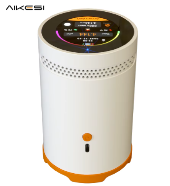
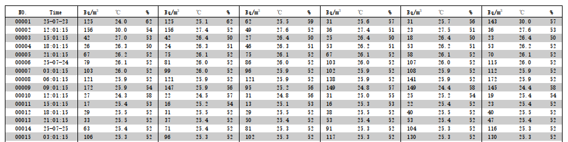
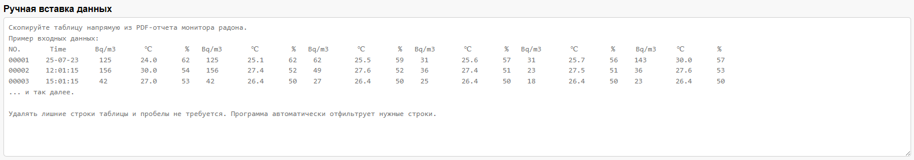
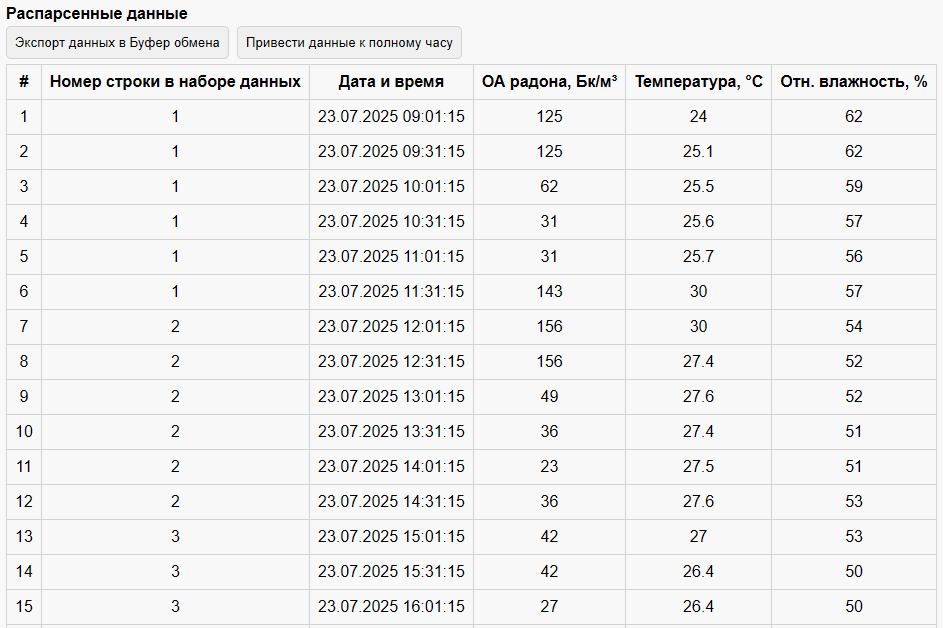

# RM-75 Converter
Данная утилита предназначена для парсинга данных из PDF-отчетов, генерируемых мониторами радона Radon Monitor RM-75 (доступен под брендом AIKESI, либо безымянным брендом на маркетплейсах). 

*Изображение с [источника](https://www.alibaba.com/product-detail/AIKESI-RM-75-Factory-OEM-Smart_1601173171365.html)*

Обоснование разработки утилиты: результаты измерений в PDF-отчете производителя даны в компактном представлении с интервалом 30 мин по столбцам и 3 часа по строкам, что неудобно для 

## Ввод данных

Доступно два варианта загрузки данных в утилиту:
- ручной,
- автоматический.

В `ручном` режиме пользователь копирует таблицы из файла PDF-отчета и вставляет в соответствующее поле для ввода. Для начала обработки (парсинга) необходимо нажать кнопку `Начать парсинг из поля ввода`.

В `автоматическом` режиме пользователь выбирает файл PDF-отчета на своем компьтере, а утилита автоматически считывает из него данные.

## Результат
Результатом будет таблица с временными метками (стандартно - 30 мин), считанными значениями объемной активности радона, температуры (при наличии) и влажности (при наличии).

